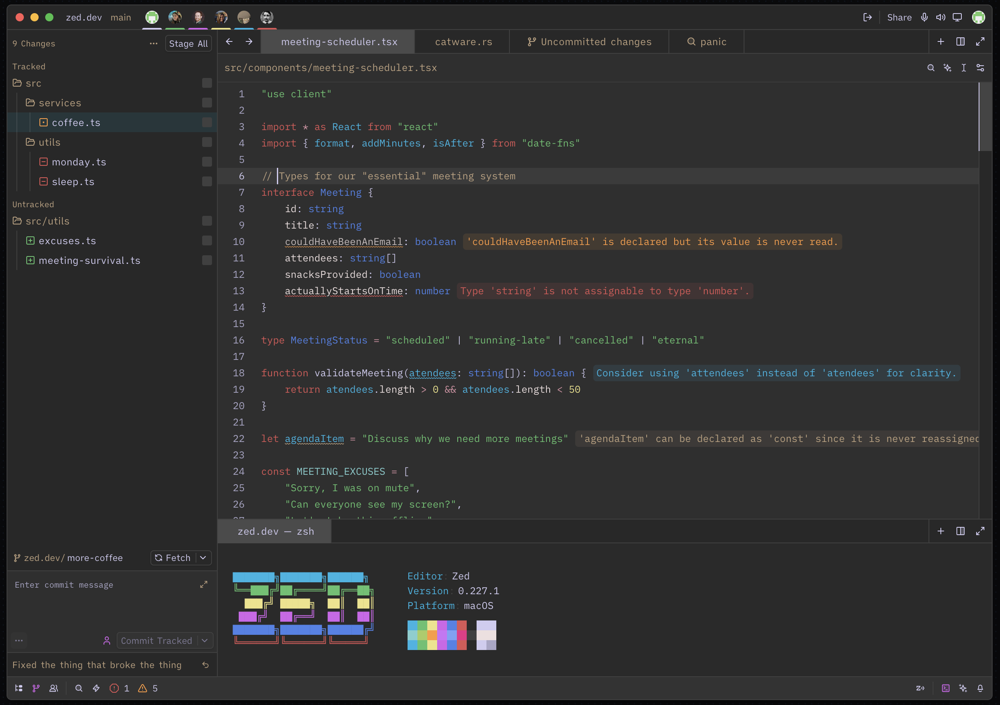
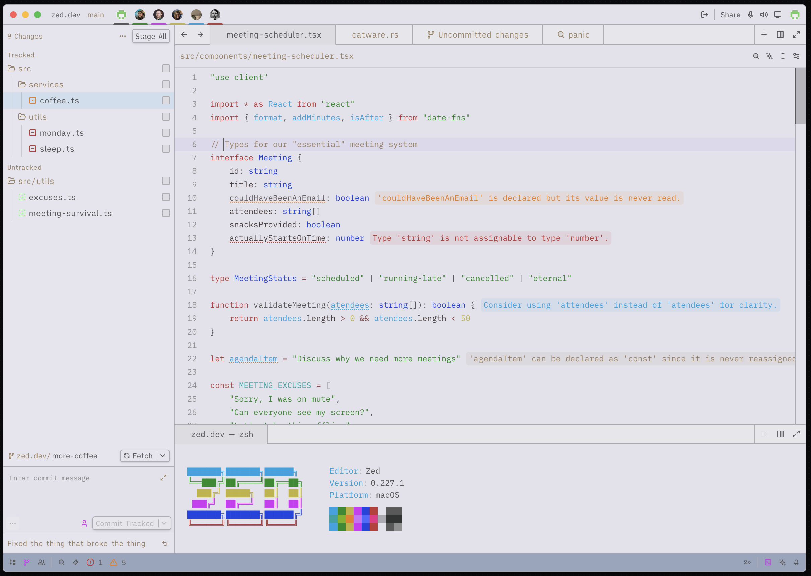

# Spinel for Zed

This repository contains a Spinel-inspired theme family for Zed, originally derived from Shopify's `Spinel` theme and tuned for readability in Zed.

## Included themes

- `Spinel Dark`
- `Spinel Light`

## Screenshots

### Spinel Dark



### Spinel Light




These themes are defined in:

- `themes/spinel.json`

## Recommended setup

For the best Ruby highlighting experience in Zed, use:

1. the official Ruby extension
2. `ruby-lsp`
3. semantic tokens enabled for Ruby
4. the Spinel theme from this repository
5. custom semantic token rules

For example:

```jsonc
{
  "theme": {
    "mode": "system",
    "light": "Spinel Light",
    "dark": "Spinel Dark"
  },
  "languages": {
    "Ruby": {
      "semantic_tokens": "combined",
      "language_servers": ["ruby-lsp", "!solargraph", "!rubocop", "..."]
    }
  },
  "global_lsp_settings": {
    "semantic_token_rules": [
      // ---------------------------------------------------------------------
      // This prevents parameters from being coerced into variables.
      {
        "token_type": "parameter",
        "style": ["parameter", "variable.parameter", "variable"]
      },
      // ---------------------------------------------------------------------

      // ---------------------------------------------------------------------
      // This makes readonly variables appear differently from mutable
      // variables.
      {
        "token_type": "variable",
        "token_modifiers": ["readonly"],
        "style": ["constant", "variable"]
      },
      // ---------------------------------------------------------------------

      // ---------------------------------------------------------------------
      // This makes builtins like `self` in Ruby look distinct from variables.
      {
        "token_type": "variable",
        "token_modifiers": ["default_library"],
        "style": ["constant.builtin", "variable.special", "variable.builtin"]
      }
      // ---------------------------------------------------------------------
    ]
  }
}
```

## Credits

This theme is originally derived from Shopify's Spinel theme in `vscode-shopify-ruby`, with substantial Zed-specific tuning.

Theme source:
https://github.com/Shopify/vscode-shopify-ruby/tree/main/themes
